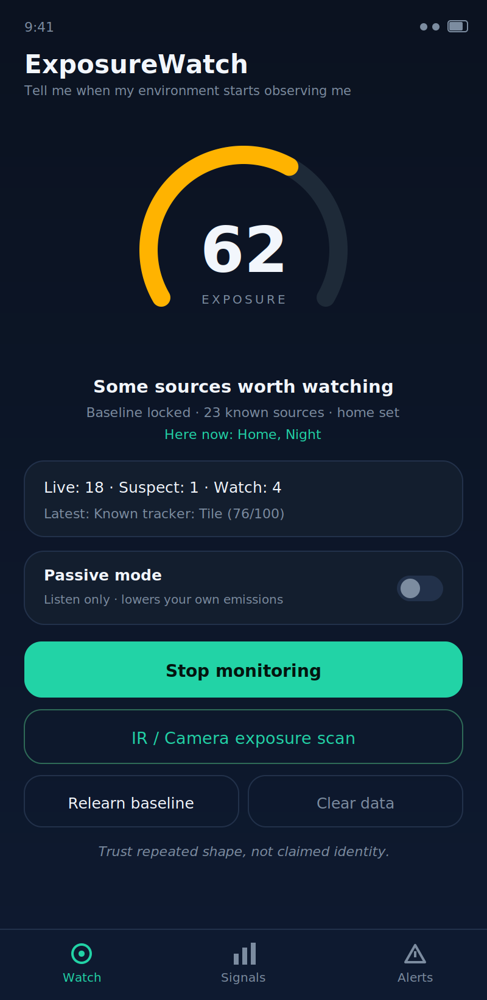
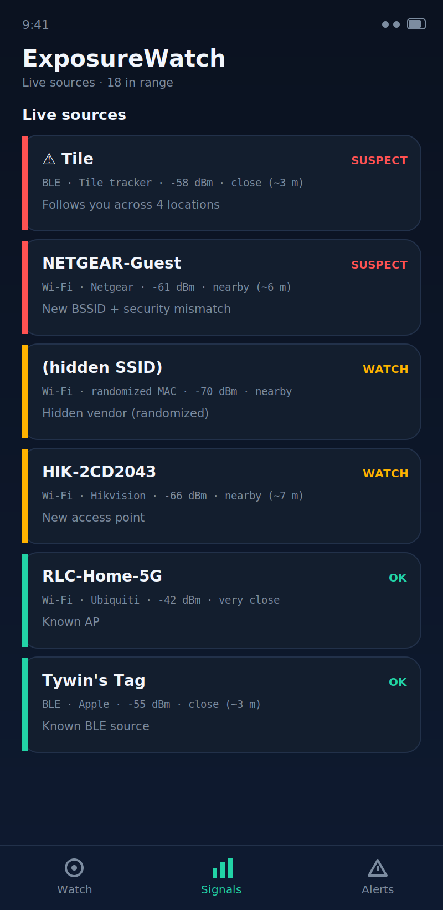
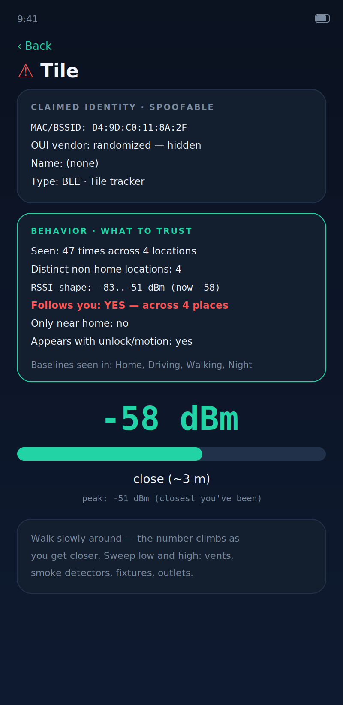

<div align="center">

# ExposureWatch

**Tell me when my environment starts observing me.**

*Trust repeated shape, not claimed identity.*

[](https://developer.android.com)
[](https://kotlinlang.org)
[](../../releases/latest)
[](#privacy-by-construction)
[](LICENSE)

</div>

---

## The idea

Every counter-surveillance app I could find asks the wrong question. They ask *what is this device called?* — reading the MAC address, the vendor prefix, the broadcast name. But all three of those are **claims**, and a claim is trivially forged. A cloned access point announces your home network's name. A tracker rotates its address every fifteen minutes. A camera hides behind a randomized MAC and reports no vendor at all.

ExposureWatch asks a different question: **how does this thing behave, over time and across places?**

Behaviour is expensive to fake. A device can lie about its name, but it cannot easily lie about the shape of its beacon frames, the fact that it has appeared beside you in four different towns, or that it only ever shows up after midnight. So the app separates the two and shows you both side by side — the claim, marked as untrustworthy, and the behavioural profile it has actually earned.

---

## Screens

<div align="center">

&nbsp;

&nbsp;

</div>

<div align="center"><sub><i>Dashboard · Live sources · Claim-vs-behaviour detail. UI renders generated from the app's layout definitions.</i></sub></div>

---

## What it detects

The scoring engine watches for behavioural contradictions rather than blacklisted names. Each finding carries a 0–100 score and an evidence list explaining *how* the conclusion was reached.

| Signal | Score | What tripped it |
|---|:--:|---|
| **Followed across locations** | 84 | Same source seen with you in 3+ distinct non-home places |
| **Known tracker tag** | 76 | Advertisement matches AirTag / Find My, Samsung SmartTag, or Tile |
| **Wi-Fi identity spoof** | 74 | A trusted BSSID whose security profile silently changed — clone signature |
| **Evil-twin access point** | 72 | Your SSID broadcast by an unfamiliar BSSID with mismatched security |
| **Home device seen elsewhere** | 70 | A source that only ever appeared at home is now travelling with you |
| **Tracker-like persistence** | 68 | Non-baseline BLE source reappearing scan after scan |
| **Ranging-capable AP** | 48 | New 802.11mc/FTM hardware that can actively measure your distance |
| **Hidden vendor** | 42 | Randomized MAC — the locally-administered bit is set, so no vendor is knowable |
| **Rotating identity** | 40 | One radio fingerprint appearing under several addresses |
| **Night-only source** | 40 | A source that has only ever been observed between 22:00 and 06:00 |

---

## How it works

### 1 · Fingerprinting the radio, not the label

Each source is reduced to a SHA-256 fingerprint built only from attributes a spoofer would have to physically reproduce:

```
Wi-Fi   band · frequency · channel width · security class
        802.11 standard · FTM/RTT responder flag
        SHA-256 of the beacon's information elements

BLE     manufacturer company IDs · service UUIDs
        connectable flag · TX power class
```

The information-element hash is the strongest component — it captures the raw byte structure of the beacon itself, derived from `ScanResult.getInformationElements()`. Two access points claiming the same BSSID but emitting different IEs will not match, which is exactly the clone case. *(IE extraction requires Android 11+; older devices fall back to the remaining attributes.)*

### 2 · Learning what normal looks like

The first few scan cycles are a deliberate learning window. Everything present becomes your **baseline** — the environment that is supposed to be there. Nothing in the baseline can later be flagged as following you, which is what keeps your own phone, watch, earbuds, and router quiet.

### 3 · Context, so "abnormal" means something

Every observation is tagged with the situation it occurred in, derived from framework location, speed, the clock, and the accelerometer:

```
Home · Driving · Walking · Night · Passive
```

This is what turns a vague warning into a sharp one. *Normal at the grocery store* and *abnormal outside your house at 1 a.m.* are different facts about the same device, and the app can now tell them apart.

### 4 · Finding the thing physically

Signal strength has no direction — a phone cannot give you a bearing. So the detail screen gives you a live homing meter with peak-hold instead: the number climbs as you close in, and you triangulate by walking. Crude, and it works.

---

## Privacy by construction

| | |
|---|---|
| **No internet permission** | The app cannot make a network request. Not "does not" — *cannot*. Verify it yourself in the manifest. |
| **Encrypted at rest** | Baseline, event log, and location context are AES-256-GCM encrypted under a hardware-backed Android Keystore key. |
| **No backup exfiltration** | Cloud backup and device-transfer are explicitly disabled for app data. |
| **No accounts, no analytics** | There is no server. There is nothing to sign into. |
| **Passive mode** | Suppresses the phone's own active Wi-Fi probing and drops BLE to opportunistic scanning, so you emit far less while listening. |

---

## Honest limitations

A security tool that oversells itself is worse than no tool, so:

- **It cannot tell you that something scanned or probed *your* device.** Detecting inbound probe requests or deauthentication frames requires monitor mode, which Android does not expose to applications. That needs external hardware — an ESP32 in promiscuous mode is the natural companion, and feeding it into this scoring engine is the planned next step.
- **Detection is heuristic, not proof.** `WATCH` means *worth a glance*; `SUSPECT` means *look closely*. Mesh nodes and Wi-Fi extenders legitimately reuse an SSID across BSSIDs, so that case is deliberately scored low to hold down false positives.
- **BLE MAC rotation limits long-horizon tracking.** Modern trackers rotate addresses; the app catches them by advertisement shape and persistence, which is strong but not absolute.
- **The IR scan flags infrared-like light, not a confirmed camera.** It is a bloom-and-flicker heuristic on an RGB sensor and only works in genuine darkness.

---

## Install

Grab the APK from [**Releases**](../../releases/latest), open it on your phone, and allow installs from that source when Android asks — a one-time toggle.

**First run:** grant location, nearby-Wi-Fi, Bluetooth, and notification permissions (Android gates all scan results behind location), tap **Set current place as Home** while you're at home, then start monitoring and give it a minute to learn the baseline.

> Android 8.0+ · no account · no signup · works fully offline

---

## Build from source

```bash
git clone https://github.com/Carson1391/exposurewatch.git
cd exposurewatch
./gradlew :app:assembleDebug
```

Release builds require a `keystore.properties` at the project root pointing at your own signing keystore:

```properties
storeFile=/path/to/release.jks
storePassword=…
keyAlias=…
keyPassword=…
```

Run the detection-logic test suite with `./gradlew :app:testDebugUnitTest` — it covers fingerprint determinism, randomized-MAC detection, tracker signatures, OUI resolution, and distance monotonicity.

---

## Architecture

```
app/src/main/java/com/exposurewatch/app/
├── engine/
│   ├── Fingerprint.kt      SHA-256 radio/behaviour fingerprints incl. IE hash
│   ├── ScoringEngine.kt    signature tables + behavioural escalation
│   ├── Repository.kt       live state, baseline, encrypted persistence
│   ├── ContextProvider.kt  Home/Driving/Walking/Night context derivation
│   ├── Vendors.kt          OUI + BLE company + tracker signatures
│   └── CryptoStore.kt      AES-256-GCM via Android Keystore
├── wifi/WifiScanner.kt     ScanResult → Signal, information elements
├── ble/BleScanner.kt       BluetoothLeScanner windows, opportunistic mode
├── ir/IrDetectorActivity   CameraX luma analysis, bloom + flicker
├── ui/                     custom gauge view, list adapters
└── ExposureWatchService     foreground scan loop, alert dedup, scoring
```

**Stack:** Kotlin · Material 3 · Coroutines · CameraX · Android Keystore · zero third-party analytics or networking libraries.

---

<div align="center">
<sub>Built by <a href="https://github.com/Carson1391">Ryan Carson</a> · defensive tooling only — every capability here points inward, at detecting when <i>you</i> are the one being observed.</sub>
</div>
