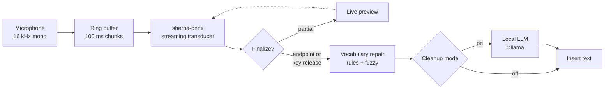

<h1 align="center">VoxFlow</h1>

<p align="center">
  <strong>Fully local, private, low-latency dictation for Windows and Android.</strong><br>
  No cloud, no account, no audio leaving the device.
</p>

<p align="center">
  
  
  
  
  
</p>

---

## What it is

A hold-to-talk and open-mic dictation system built on a 0.6B streaming
transducer ASR model running entirely on-device. Speak, and cleaned text lands
in whatever window or text field has focus.

The problem it actually solves: commercial dictation tools mangle technical
vocabulary. "K-FAC" becomes "kay fack", "QKV" becomes "cue kv", "ONNX" becomes
"onyx". VoxFlow puts a user-owned vocabulary layer between the acoustic model
and the text output, so domain terms come out spelled correctly, and adds an
optional local LLM pass for punctuation and filler removal.

| | Windows desktop | Android |
|---|---|---|
| Interface | global hotkeys, any window | custom keyboard (IME), any app |
| ASR | Nemotron 3.5 streaming 0.6B int8 | same, or 20M zipformer |
| Modes | hold-to-talk, open mic, LLM cleanup | hold-to-talk |
| Vocabulary repair | forced rules + fuzzy snapping | forced rules |
| LLM cleanup | local Ollama | not applicable |
| Network calls | none | none |

## Architecture



The recognizer is created once and held; each utterance gets a fresh stream
with the language option pinned. Audio capture runs on a dedicated callback
thread that only enqueues while a capture flag is set, so the input device
stays open with negligible idle cost and there is no device-open latency at
the start of an utterance.

## Engineering notes

Three findings from building this that shaped the design:

**1. Contextual biasing is unavailable on this model.** The obvious way to fix
domain vocabulary is decode-time hotword biasing, which sherpa-onnx supports
through `modified_beam_search`. The Nemotron transducer implementation rejects
it: only `greedy_search` is wired up, so hotword scores never enter the search.
Rather than downgrade to a weaker model that supports biasing, the correction
moved downstream of decoding into a post-ASR repair layer. It handles both
phonetic substitutions ("k fack" to "K-FAC") and multi-word rewrites
("alpha equals one over one thirty seven" to "alpha = 1/137"), and the
vocabulary is a plain text file the user edits without touching a model.

**2. Streaming transducers withhold the final token.** With 560 ms of lookahead,
the model needs right-context before it will emit the last word of an
utterance. Cutting audio at key release reliably truncated the final word.
Padding with silence alone did not fix it. The fix that worked was capturing
0.4 s of real audio after release plus 1.0 s of zero padding before calling
`input_finished`, which gives the encoder enough right-context to flush.

**3. Endpointing is what makes open-mic usable.** Hold-to-talk needs no
segmentation, but hands-free dictation does. Enabling sherpa-onnx endpoint
detection with a 1.0 s trailing-silence rule lets the app commit sentence by
sentence while continuing to listen, with a 25 s hard cap so a runaway segment
still lands. This was validated by feeding two utterances separated by silence
through the shipped code path and confirming two distinct commits.

## Quickstart: Windows

Requires Python 3.10+ and a microphone. [Ollama](https://ollama.com) is
optional and only enables the cleanup mode.

```bash
cd desktop
python setup_desktop.py     # installs deps, downloads the model (~640 MB)
python voxflow.py
```

| Key | Action |
|---|---|
| tap **F6** | open mic on/off, hands free |
| hold **F8** | dictate, insert raw transcript with vocabulary repair |
| hold **F9** | dictate, insert LLM-cleaned text |
| tap **F10** | undo the last insertion |
| tap **F7** | toggle language between `en` and `auto` |

In open-mic mode a pause of `ENDPOINT_SILENCE_SEC` (default 1.0 s) commits the
sentence and keeps listening. Tap F6 again to stop and flush.

Every setting lives in the `CONFIG` block at the top of `voxflow.py`: hotkeys,
language, thread count, endpoint timings, clipboard behavior, and the Ollama
model. `CLEANUP_MODEL = "auto"` picks an installed model and prefers Qwen; set
an exact name to pin one, or `""` to disable cleanup.

<details>
<summary><strong>Troubleshooting</strong></summary>

- **Hotkeys ignored in some windows.** Run the terminal as Administrator.
  Elevated applications only accept synthetic input from elevated processes.
- **Wrong microphone.** Set the Windows default input device, or pass
  `device=N` to `sd.InputStream`. List devices with
  `python -c "import sounddevice; print(sounddevice.query_devices())"`.
- **High CPU.** Lower `NUM_THREADS` from 8 to 4.
- **Other languages.** Set `LANGUAGE = "auto"` or a code like `es`, `ja`, `de`.
  The default model covers 40 locales.
</details>

## Quickstart: Android

Requires Android Studio and an arm64 device on Android 8.0+. The app installs
as an input method, so it dictates system-wide into any text field.

```bash
cd android
python setup_android.py       # fetches JNI libs + model into app assets
gradlew.bat assembleRelease   # or Build > Generate APKs in Android Studio
```

Install `app/build/outputs/apk/release/app-release.apk`, open VoxFlow, and the
setup screen walks through three steps: grant microphone permission, enable the
keyboard, switch to it. Then hold the button, speak, release.

Model options:

| Flag | Model | APK | Load time | Notes |
|---|---|---|---|---|
| default | Nemotron 3.5 multilingual 0.6B int8 | ~680 MB | a few seconds | best accuracy, 40 languages |
| `--model 2` | zipformer English 20M | ~30 MB | instant | good first build to validate the flow |

The release build is intentionally debug-signed so it sideloads without a
keystore. Do not publish it as-is.

## Vocabulary

One shared file at the repo root, `hotwords.txt`, read by both platforms.

```
QKV                                  # canonical term: fixes casing, fuzzy-snaps near misses
k fack => K-FAC                      # forced rewrite, case-insensitive, word-boundary
alpha equals one over one thirty seven => alpha = 1/137
```

Desktop picks up edits on restart. For Android run
`python setup_android.py --vocab-only` and rebuild.

## Repository layout

```
voxflow/
├── hotwords.txt              shared vocabulary (canonical terms + rewrite rules)
├── desktop/
│   ├── setup_desktop.py      dependency install + model download
│   └── voxflow.py            the app: capture, decode, repair, cleanup, insert
└── android/
    ├── setup_android.py      model into assets, calls fetch_libs
    ├── fetch_libs.py         pulls pinned arm64 JNI binaries
    └── app/src/main/
        ├── java/com/rlc/voxflow/     VoxFlowIME, SetupActivity, Vocab
        └── java/com/k2fsa/sherpa/onnx/   vendored Apache-2.0 Kotlin API
```

Models and prebuilt binaries are not committed. The setup scripts fetch them
from pinned upstream releases, so a fresh clone reproduces the exact build.

## License

MIT for this project's code. Bundled sherpa-onnx components (arm64 JNI
libraries and the Kotlin API) are Apache 2.0; see
[`android/NOTICE-sherpa-onnx.txt`](android/NOTICE-sherpa-onnx.txt).

Built on [sherpa-onnx](https://github.com/k2-fsa/sherpa-onnx) by the k2-fsa
project and NVIDIA's Nemotron streaming ASR models.
